

  

<h1 align="center">Gazii Taoshif</h1>

<strong>Software Engineer · Full-Stack Developer · Founder of Taoshiflex Studio</strong>

  Building full-stack products, web platforms and practical software systems.

  

  <a href="https://taoshiflexstudio.me"><strong>Taoshiflex Studio</strong></a>
  &nbsp;·&nbsp;
  <a href="https://webdevportfolio-three.vercel.app">Portfolio</a>
  &nbsp;·&nbsp;
  <a href="https://www.linkedin.com/in/taoshif1/">LinkedIn</a>
  &nbsp;·&nbsp;
  <a href="mailto:taoshif2@gmail.com">Email</a>

## About

I am a Computer Science and Engineering student at East West University in Bangladesh, focused on software engineering and full-stack product development. I work primarily with JavaScript and TypeScript, building complete web systems from user interfaces to APIs and data layers. I am the founder of **[Taoshiflex Studio](https://taoshiflexstudio.me)**, where I build websites, e-commerce systems, and custom digital products.

## Featured Work

| Project | What it is | Stack | Links |
| --- | --- | --- | --- |
| **Taoshiflex Studio** | My web design and development studio for business websites, e-commerce systems, and custom digital products. | `Next.js` `TypeScript` `Supabase` `PostgreSQL` `Tailwind CSS` | [Source](https://github.com/Taoshif1/Taoshiflex-Studio) · [Live](https://taoshiflexstudio.me) |
| **RedFlint** | A full-stack menswear storefront with authentication, product and inventory management, checkout, order tracking, customer tools, and an admin dashboard. | `React` `Node.js` `Express` `MongoDB` `Firebase` | [Client](https://github.com/Taoshif1/RedFlint-client) · [Server](https://github.com/Taoshif1/RedFlint-server) · [Live](https://red-flint-client.vercel.app/) |
| **Kotha's Aura** | A full-stack women's lifestyle e-commerce experience with a luxury-focused interface and production backend. | `React` `Node.js` `Express` `MongoDB` | [Client](https://github.com/Taoshif1/kothas-Aura-Client) · [Server](https://github.com/Taoshif1/kothas-Aura-Server) |
| **Flocka** | A motion-heavy digital agency showcase using advanced frontend animation and 3D graphics. | `React` `GSAP` `Framer Motion` `Three.js` | [Source](https://github.com/Taoshif1/JT1-Flocka) |

## Current Focus

- Growing Taoshiflex Studio and working with real clients
- Building and refining full-stack product workflows
- Strengthening TypeScript, software architecture, API, and data-layer skills
- Applying computer science fundamentals through university work and practical projects

## Core Stack

| Area | Technologies |
| --- | --- |
| Frontend | `React` `Next.js` `TypeScript` `JavaScript` `HTML` `CSS` `Tailwind CSS` |
| Backend | `Node.js` `Express` `REST APIs` |
| Data | `MongoDB` `PostgreSQL` `Supabase` |
| Tools | `Git` `GitHub` `Vercel` `Postman` |
| Programming background | `Java` `C` `C++` `Python` |

## GitHub Activity

  

  

## Work With Me

For websites, e-commerce systems, custom web applications, or development work:

[Taoshiflex Studio](https://taoshiflexstudio.me) · [Portfolio](https://webdevportfolio-three.vercel.app) · [GitHub](https://github.com/Taoshif1) · [LinkedIn](https://www.linkedin.com/in/taoshif1/) · [Email](mailto:taoshif2@gmail.com)
